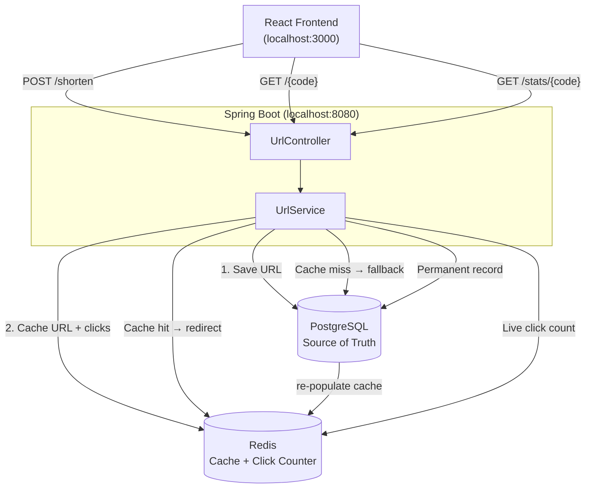

# URL Shortener — Spring Boot + PostgreSQL + Redis + React

## Architecture



| Concern | PostgreSQL | Redis |
|---|---|---|
| URL storage | permanent | cached (30d TTL) |
| Click counts | synced on stats call | live atomic INCR |
| Cache miss | fallback source | re-populated automatically |

## Run

**1. Start PostgreSQL + Redis**
```bash
docker-compose up -d
```

**2. Start backend**
```bash
cd backend
mvn spring-boot:run
# runs on http://localhost:8080
# JPA auto-creates the url_mappings table on first boot
```

**3. Start frontend**
```bash
cd frontend
npm install
npm run dev
# runs on http://localhost:3000
```

## API

| Method | Path | Description |
|--------|------|-------------|
| POST | `/shorten` | `{"url": "https://..."}` → `{"shortUrl": "...", "code": "..."}` |
| GET | `/{code}` | Redirect to original URL |
| GET | `/stats/{code}` | Returns click count + original URL |

## Redis Key Design

```
url:{code}     → original URL  (TTL: 30 days)
clicks:{code}  → click count   (atomic INCR, TTL: 30 days)
```

`INCR` is atomic in Redis — no race conditions under high traffic. On cache miss, both keys are re-populated from PostgreSQL.
